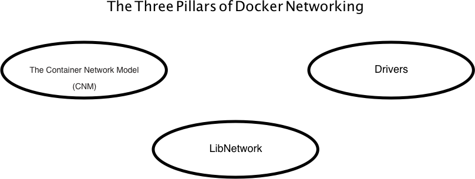

# Docker Workshop - Docker Network

## Sections:

* [The Three Pillars of Docker Networking](#the-three-pillars-of-docker-networking)
* [The Container Network Model](#the-container-network-model)
* [LibNetwork](#libnetwork)
* [Drivers](#drivers)
* [Bread Crumb Navigation](#bread-crumb-navigation)

## The Three Pillars of Docker Networking

## The Container Network Model

Libnetwork implements Container Network Model (CNM) which formalizes the steps required to provide networking for containers while providing an abstraction that can be used to support multiple network drivers. The CNM is built on 3 main components (shown below)

[Libnetwork Documentation](https://github.com/docker/libnetwork/blob/master/docs/design.md)

### Sandbox

A Sandbox contains the configuration of a container's network stack. This includes management of the container's interfaces, routing table and DNS settings. An implementation of a Sandbox could be a Linux Network Namespace, a FreeBSD Jail or other similar concept. A Sandbox may contain many endpoints from multiple networks.

### Endpoint

An Endpoint joins a Sandbox to a Network. An implementation of an Endpoint could be a veth pair, an Open vSwitch internal port or similar. An Endpoint can belong to only one network but may only belong to one Sandbox.

### Network

A Network is a group of Endpoints that are able to communicate with each-other directly. An implementation of a Network could be a Linux bridge, a VLAN, etc. Networks consist of many endpoints.

## LibNetwork

[LibNetwork Goals](https://github.com/docker/libnetwork/blob/master/docs/design.md#goal)

* libnetwork project will follow Docker and Linux philosophy of developing small, highly modular and composable tools that work well independently.
* Libnetwork aims to satisfy that composable need for Networking in Containers.

Libnetwork includes the following driver packages:

* null
* bridge
* overlay
* remote

## Drivers

[Drivers Documentation](https://github.com/docker/libnetwork/blob/master/docs/design.md#drivers)

* Drivers are essentially an extension of libnetwork and provide the actual implementation for all of the LibNetwork APIs defined above.
* Hence there is an 1-1 correspondence for all the Network and Endpoint APIs, which includes :

* driver.Config
* driver.CreateNetwork
* driver.DeleteNetwork
* driver.CreateEndpoint
* driver.DeleteEndpoint
* driver.Join
* driver.Leave

* Driver is not a user visible object, but drivers provides the actual implementation that makes network work.
* NetworkController however provides an API to configure any specific driver with driver-specific options/labels that is transparent to libnetwork, but can be handled by the drivers directly.
* Drivers can be both inbuilt (such as Bridge, Host, None & overlay) and remote (from plugin providers) to satisfy various usecases & deployment scenarios.
* At this point, the Driver owns a network and is responsible for managing the network (including IPAM, etc.)* This can be improved in the future by having multiple drivers participating in handling various network management functionalities.

## Bread Crumb Navigation
_________________________

Previous | Next
:------- | ---:
← [Docker Compose](../docker-compose/README.md) | [Docker Machine](../docker-machine/README.md) →

