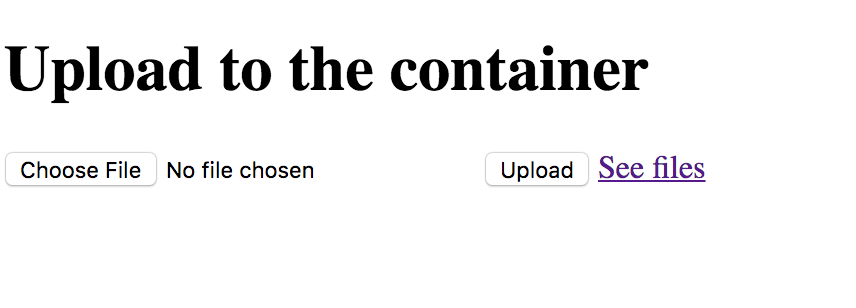

# Docker Workshop - Volumes

# Sections
* [Data volumes](#data-volumes)
* [Add a data volume](#add-a-data-volume)
* [Locate a volume](#locate-a-volume)
* [Mount a host directory as a data volume](#mount-a-host-directory-as-a-data-volume)
* [List all volumes](#list-all-volumes)
* [Remove volumes](#remove-volumes)
* [Important tips on using shared volumes](#important-tips-on-using-shared-volumes)

[Manage Data in containers](https://docs.docker.com/engine/tutorials/dockervolumes/)

## Data volumes
_________________________

[Data volumes](https://docs.docker.com/engine/tutorials/dockervolumes/#data-volumes)

* A data volume is a specially-designated directory within one or more containers that bypasses the Union File System.
* Data volumes provide several useful features for persistent or shared data:

* Volumes are initialized when a container is created.
* If the container’s parent image contains data at the specified mount point, that existing data is copied
    * into the new volume upon volume initialization.
* Data volumes can be shared and reused among containers.
* Changes to a data volume are made directly.
* Changes to a data volume will not be included when you update an image.
* Data volumes persist even if the container itself is deleted.
* Data volumes are designed to persist data, independent of the container’s lifecycle.
* Docker therefore never automatically deletes volumes when you remove a container, nor will it “garbage collect” volumes that are no longer referenced by a container.

## Add a data volume
_________________________

* You can add a data volume to a container using the -v flag with the docker create and docker run command. * You can use the -v multiple times to mount multiple data volumes.
* Now, mount a single volume in your web application container.

Example
```bash
$ docker run -d -P --name myworld -v /var/www/app /var/www/webapp node server.js
```

## Locate a volume
_________________________

[Locate a volume](https://docs.docker.com/engine/tutorials/dockervolumes/#locate-a-volume)

You can locate the volume on the host by utilizing the docker inspect command.

```bash
$ cd $(pwd)/code/volume
$ docker build -t myworld .
Sending build context to Docker daemon  2.048kB
Step 1/4 : FROM nginx:1.8-alpine
 ---> c0dddb65129b
Step 2/4 : RUN mkdir /myvol
 ---> Running in a1202772bb2d
 ---> 235985e2eb66
Removing intermediate container a1202772bb2d
Step 3/4 : RUN echo "hello world" > /myvol/greeting
 ---> Running in d2825cd6b4cc
 ---> 3990fa008013
Removing intermediate container d2825cd6b4cc
Step 4/4 : VOLUME /myvol
 ---> Running in a608dea8adf2
 ---> 811f7c31e569
Removing intermediate container a608dea8adf2
Successfully built 811f7c31e569
Successfully tagged myworld:latestb

# Copy image id from the part that says Successfully Built
$ docker run -it 811f7c31e569  bash
$ docker inspect 811f7c31e569
...
...
"Volumes": {
    "/myvol": {}
},
...
...
```

## Mount a host directory as a data volume
_________________________

* The -v flag can also be used to mount a single file - instead of just directories - from the host machine.

```bash
$ cd $(pwd)/code/volume

$ docker build -t volume .
$ docker run -p 3004:3004 -v $(pwd)/public:/var/www/app/public -d volume
$ docker ps
$ docker ps
CONTAINER ID        IMAGE               COMMAND             CREATED              STATUS              PORTS                    NAMES
845f10d27f46        volume              "npm start"         About a minute ago   Up About a minute   0.0.0.0:3004->3004/tcp   eager_newton

$ open "http://localhost:3004"
$ docker exec -it 845f10d27f46 /bin/sh
```

You should see this in your default browser if the container is running:



```bash
$ docker ps
$ docker stop 845f10d27f46
$ docker rm 845f10d27f46
$ docker run -p 3004:3004 -v $(pwd)/public:/var/www/app/public -d volume
$ docker ps
CONTAINER ID        IMAGE               COMMAND             CREATED             STATUS              PORTS                    NAMES
92cf83fe29ad        volume              "npm start"         7 seconds ago       Up 5 seconds        0.0.0.0:3004->3004/tcp   silly_ritchie

$ docker exec -it 92cf83fe29ad /bin/sh
# inside container now

 /var/www/app # ls public/
# should list the file that you uploaded because it is a data volume
```

## List all volumes
_________________________

* You can list all existing volumes using `docker volume ls`.

```bash
$ docker volume ls
DRIVER              VOLUME NAME
local               0b59c34bdd779a300f7c0f9d020920695e416ed1bbc54413449f2239b1195317
local               16b8335b4f40ff448e687694f7793f034d3b1a7047ac783b2f7e90e6395fa638
local               17826bfcc57a1e09f96727f64befc34b2c0a42b87173fe40cbb4ded4075a077d
local               17a013dfa5454d4c92b966efe03db9679de701688a4ef30cdd131e8d47fae36e
local               1f290b3b39ad3e7f99c1c6b145cb2b6f91fc221d9c8ca0037d2e186d461df60b
local               2edbb5dd95afa9347997e1a4cf6a7d39620db2ed058c52023df4fc286a7b6936
```

## Remove Volumes
_________________________

[Remove Volumes Documentation](https://docs.docker.com/engine/tutorials/dockervolumes/#remove-volumes)

* A Docker data volume persists after a container is deleted.
* You can create named or anonymous volumes.
* Named volumes have a specific source form outside the container, for example awesome:/bar.
* Anonymous volumes have no specific source.
* When the container is deleted, you should instruct the Docker Engine daemon to clean up anonymous volumes.
* To do this, use the `--rm` option, for example:

`$ docker run --rm -v /foo -v awesome:/bar busybox top`

* This command creates an anonymous /foo volume.
* When the container is removed, the Docker Engine removes the /foo volume but not the awesome volume.

```bash
$ ls public
## Notice that the file is still sitting locally in your folder
```

To remove all unused volumes and free up space:

`$ docker volume prune`

If you try to remove a data volume in use docker will issue an error

```bash
$ docker volume ls
docker volume ls
DRIVER              VOLUME NAME
local               0264dec3eff9960ff480f573da464b1767ab9b027d204f11013e6721001c777b
local               17826bfcc57a1e09f96727f64befc34b2c0a42b87173fe40cbb4ded4075a077d

$ docker volume rm 0264dec3eff9960ff480f573da464b1767ab9b027d204f11013e6721001c777b 17826bfcc57a1e09f96727f64befc34b2c0a42b87173fe40cbb4ded4075a077d

## You might see output like this
27f64befc34b2c0a42b87173fe40cbb4ded4075a077d
0264dec3eff9960ff480f573da464b1767ab9b027d204f11013e6721001c777b
Error response from daemon: unable to remove volume: remove 17826bfcc57a1e09f96727f64befc34b2c0a42b87173fe40cbb4ded4075a077d: volume is in use - [f60a925f4bf7b9339bc5d04de119fc01e30335fd9625390bc66ed974fbc2607a]
```

## Important tips on using shared volumes

[Documentation](https://docs.docker.com/engine/tutorials/dockervolumes/#important-tips-on-using-shared-volumes)

* Multiple containers can also share one or more data volumes.
* However, multiple containers writing to a single shared volume can cause data corruption.
* Make sure your applications are designed to write to shared data stores.
* Data volumes are directly accessible from the Docker host.
* This means you can read and write to them with normal Linux tools.
* In most cases you should not do this as it can cause data corruption
    * if your containers and applications are unaware of your direct access.

## Bread Crumb Navigation
_________________________

Previous | Next
:------- | ---:
← [Dockerfile Usage](../dockerfile/README.md) | [Docker Compose](../docker-compose/README.md) →
